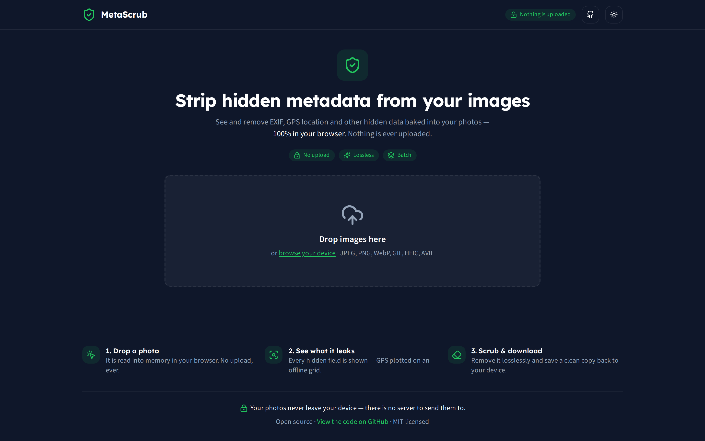
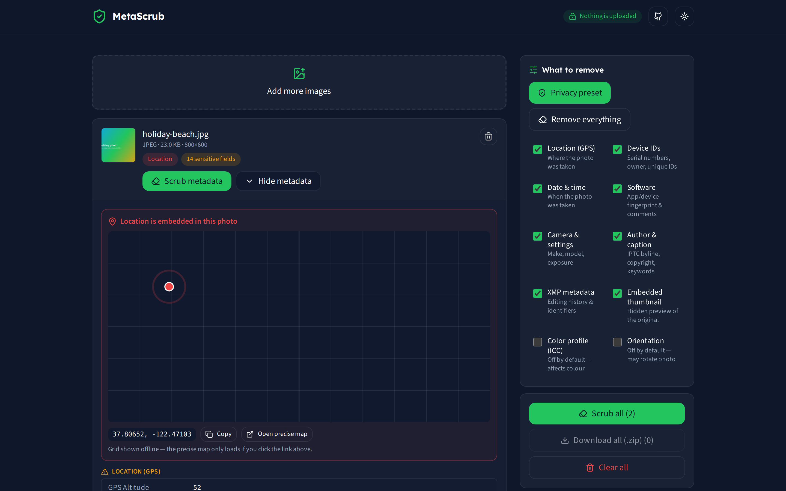
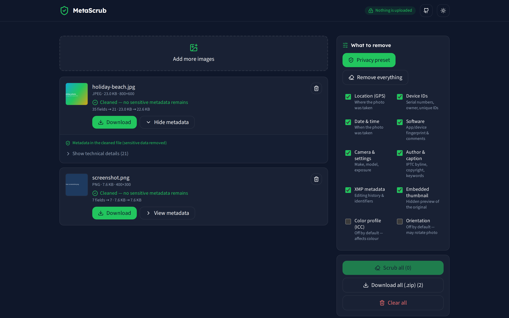

<div align="center">

# MetaScrub

### Strip hidden metadata from your images — 100% in your browser. Nothing is ever uploaded.

[](LICENSE)




</div>

## What is this?

**MetaScrub** is a private, in-browser viewer and scrubber for image metadata.
Drop in a photo and instantly see everything hidden inside it — **GPS location**,
camera make/model and serial numbers, software fingerprints, timestamps, IPTC
captions, XMP history, embedded thumbnails — then remove it, selectively or
completely, and save a clean copy.

Every byte of work happens **in your browser tab**. There is no server, no
account, no upload, no tracking — and that isn't just a promise: the app ships
with a strict Content-Security-Policy (`connect-src 'none'`) that makes it
technically incapable of sending your photo anywhere.

## Why it exists

Most photos carry hidden metadata, and people assume the apps they post to strip
it — but that behaviour is inconsistent, and a GPS tag can point straight at your
home. The honest fix is to strip metadata **before** sharing. Yet most popular
online "EXIF removers" do it by **uploading your photo to their server** — the
exact thing a privacy-minded person is trying to avoid.

MetaScrub is the open-source, no-signup, no-ads, **genuinely local** answer:

- **It never uploads.** Enforced by CSP, verifiable in DevTools (zero network requests).
- **It's lossless for JPEG/PNG/WebP/GIF.** Metadata is removed by editing the
  file's segments/chunks directly — your pixels are byte-for-byte untouched.
- **It shows you the risk.** GPS coordinates are plotted on a fully offline map
  so you *see* what you're leaking before you remove it.
- **It does batch.** Drop a whole folder; download all cleaned files as a zip.

> Read the research behind the idea in [`RESEARCH.md`](RESEARCH.md), the scope in
> [`SPEC.md`](SPEC.md), the design in [`ARCHITECTURE.md`](ARCHITECTURE.md), and the
> QA in [`REVIEW.md`](REVIEW.md).

## Screenshots

| Inspect & locate | After scrubbing |
|---|---|
|  |  |

## Features

- **View all metadata** — EXIF, GPS, IPTC, XMP, ICC, embedded thumbnails, camera
  settings, dimensions — grouped and with the **sensitive fields flagged first**.
- **Offline GPS preview** — coordinates plotted on a bundled coordinate-grid map.
  No map tiles are ever fetched; an explicit, user-clicked link opens the precise
  map in a new tab.
- **Scrub** — one-click **Privacy preset** (remove GPS + device IDs + dates +
  software + camera + IPTC + XMP + thumbnail, keep orientation & colour),
  **Remove everything**, or a **custom** per-group selection.
- **Lossless** byte-level stripping for **JPEG, PNG, WebP, GIF**.
- **HEIC / AVIF** are decoded and re-encoded to a clean JPEG/PNG (clearly labelled
  as a re-encode + format change — browsers can't edit HEIC in place).
- **Batch** processing and **Download all (.zip)**.
- **Works offline**, installable, dark/light themes, fully keyboard-accessible.
- **Supported input:** JPEG, PNG, WebP, GIF, HEIC/HEIF, AVIF, TIFF (TIFF is
  view-only — see Limitations).

## Privacy & security

| Guarantee | How it's enforced |
|---|---|
| Photos never leave your device | No `fetch`/`XHR` anywhere; strict CSP `connect-src 'none'` |
| Can't be embedded/clickjacked | `frame-ancestors 'none'` / `X-Frame-Options: DENY` (host headers) |
| No tracking / no accounts | No analytics, no cookies; only a theme string in `localStorage` |
| Self-hosted fonts | Bundled woff2 — no Google Fonts CDN request |
| Auditable | Open source, MIT, small dependency set, no minified vendor blobs committed |

## Quick start

```bash
git clone https://github.com/Skytuhua/metascrub.git
cd metascrub
npm install
npm run dev      # start the dev server (Vite) and open the printed URL
```

### Build & run the production site

```bash
npm run build    # outputs a static site to dist/
npm run preview  # serve the built site locally
```

`dist/` is a plain static bundle — host it on any static host (GitHub Pages,
Netlify, Cloudflare Pages, Vercel) or serve it yourself (`npx serve dist`). The
repo includes `public/_headers` and `vercel.json` with the recommended security
headers. Or grab the prebuilt **`metascrub-static.zip`** from the
[latest release](https://github.com/Skytuhua/metascrub/releases) and serve it.

### Scripts

| Command | Does |
|---|---|
| `npm run dev` | Dev server with HMR |
| `npm run build` | Production static build to `dist/` |
| `npm run preview` | Serve the production build |
| `npm test` | Run the unit/robustness test suite (Vitest) |
| `npm run coverage` | Test coverage for `src/core` |
| `npm run lint` | ESLint |

## How it works (under the hood)

The framework-free engine lives in [`src/core/`](src/core) and is fully unit-tested:

- `read.ts` parses all metadata with [`exifr`](https://github.com/MikeKovarik/exifr).
- `sensitivity.ts` classifies each field and flags what's privacy-sensitive.
- `scrub/jpeg.ts` removes metadata by walking JPEG marker segments and rebuilding
  a minimal EXIF block with [`piexifjs`](https://github.com/hMatoba/piexifjs) for
  selective keeps (e.g. orientation) — **the image scan is never re-encoded**.
- `scrub/{png,webp,gif}.ts` edit chunks/blocks directly (lossless).
- `scrub/heic.ts` lazy-loads a WASM decoder only when needed.
- `zip.ts` is a tiny dependency-free ZIP writer for batch downloads.

The UI ([`src/ui/`](src/ui)) only orchestrates this core and touches the DOM.

## Limitations

- **TIFF**: metadata is viewable but stripping isn't supported in-browser (no
  lossless TIFF rewrite). Flagged in the UI.
- **HEIC/AVIF**: cleaning requires a decode + re-encode (format change to
  JPEG/PNG), since browsers can't edit these in place. Stated plainly in the app.
- **JPEG with EXIF placed *after* the image scan** (a rare, non-standard layout)
  isn't stripped — everything past the start-of-scan is copied verbatim so pixels
  are guaranteed untouched. Standard photos place EXIF before the scan.

## Contributing

Issues and PRs welcome. Run `npm test && npm run lint` before submitting.

## License

[MIT](LICENSE) © Skytuhua. Third-party components and their licenses are listed
in [`THIRD-PARTY-NOTICES.md`](THIRD-PARTY-NOTICES.md).
